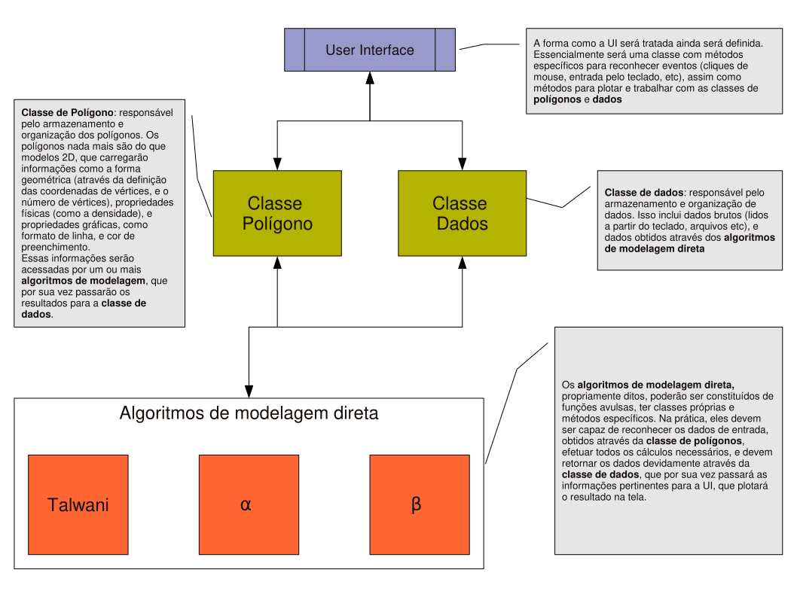
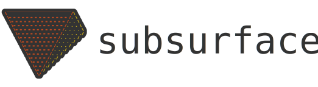

# About

<div class="lead">
<em>Fatiando a Terra</em> is a collection of <strong>open-source Python
packages</strong> aimed primarily at Geophysics (though not exclusively).
This page contains some information about the project and its history.
</div>

```{admonition} Trivia
*Fatiando a Terra* is Portuguese for *Slicing the Earth*, a reference to the
project's Brazilian origins and ambitious initial goals to model the whole
planet.
```

## Brief history

The Fatiando a Terra project had it's start around 2008 as a C++ program to
perform geophysical modeling of various data types (gravity, magnetics,
seismic, etc.).
At least that was what a
{ref}`small group of Geophysics undergraduate students <founders>` at the
[University of São Paulo][usp], Brazil, set out to do.
Unsurprisingly, this overly ambitious goal was never achieved.

<div class="row text-muted align-items-center fs-6">
<div class="col-md-9">



</div>
<div class="col-md-3">

First diagram (in Portuguese) of the planned graphical user interface (GUI) for
the Fatiando C++ program.
Retrieved from commit [<i class="fab fa-github"></i> 10c8ff7][commit-gui]
from 11 February 2009.

</div>
</div>

In 2010, we started developing the [`fatiando`][gh-fatiando]
Python library, which included several state-of-the-art methods for forward
modeling and inversion of gravity and magnetic data, as well as toy problems in
other fields useful for teaching.
Development of this library was discontinued in 2018  as our focus shifted to
our newer and more well-scoped libraries.
This [blog post announcing the shift][blog-fatiando-future] explains the
reasoning behind this decision.

```{note}
The last version that was released of `fatiando` is [v0.5][v0.5-doi].
The documentation for it can still be accessed at
[legacy.fatiando.org](https://legacy.fatiando.org)
```

<div class="row text-muted align-items-center fs-6">
<div class="col-md-9">

<!-- Thumbnail of Youtube video -->
<div class="ratio ratio-16x9">
  <div class="yt" style='background-image: url("/_static/fatiando-talks.jpg")'>
    <a
      href="https://www.youtube.com/watch?v=z-5dvWfB_SM&list=PLPA_RM8wsOqLQRajw_e9ByUe56z7TETaL"
      aria-label="Watch on YouTube"
      target="_blank"
      rel="noopener noreferrer"
    >
      <div class="play-button">
        
      </div>
    </a>
    <a
      href="https://www.youtube.com/watch?v=z-5dvWfB_SM&list=PLPA_RM8wsOqLQRajw_e9ByUe56z7TETaL"
      aria-label="Watch on YouTube"
      target="_blank"
      rel="noopener noreferrer"
    >
      <div class="watch-on-yt">
        <div aria-hidden="true">Watch on</div>
        <div></div>
      </div>
    </a>
  </div>
</div>

</div>

<div class="col-md-3">

Our [YouTube channel][youtube] has a [playlist of talks][yt-playlist] given
about Fatiando over the years.

</div>
</div>

## The geophysics Python ecosystem

Fatiando is a part of the larger geophysics open-source Python ecosystem,
which has grown tremendously since we started development in 2010.

<div class="row gy-4 py-3 align-items-center">
<div class="col-6 col-sm-4 col-md-3">
  <a target="_blank" href="https://simpeg.xyz/">
  
  </a>
</div>
<div class="col-6 col-sm-4 col-md-3">
  <a target="_blank" href="https://www.gempy.org/">
  
  </a>
</div>
<div class="col-6 col-sm-4 col-md-3">
  <a target="_blank" href="https://emsig.xyz/">
  
  </a>
</div>
<div class="col-6 col-sm-4 col-md-3">
  <a target="_blank" href="https://docs.pyvista.org/">
  
  </a>
</div>
<div class="col-6 col-sm-4 col-md-3">
  <a target="_blank" href="https://www.pygimli.org/">
  
  </a>
</div>
<div class="col-6 col-sm-4 col-md-3">
  <a target="_blank" href="https://softwareunderground.github.io/subsurface/">
  
  </a>
</div>
<div class="col-6 col-sm-4 col-md-3">
  <a target="_blank" href="https://www.pygmt.org/">
  
  </a>
</div>
<div class="col-6 col-sm-4 col-md-3">
  
</div>
</div>

[youtube]: https://www.youtube.com/fatiandoorg
[yt-playlist]: https://youtube.com/playlist?list=PLPA_RM8wsOqLQRajw_e9ByUe56z7TETaL
[gh]: https://github.com/fatiando
[gh-fatiando]: https://github.com/fatiando/fatiando
[usp]: https://www.iag.usp.br/
[commit-gui]: https://github.com/fatiando/fatiando/blob/10c8ff7c17df53e3e0abd83f1ce8d2a3f6bc57aa/fluxo-simples.pdf
[pinga]: https://www.pinga-lab.org/
[v0.5-doi]: https://doi.org/10.5281/zenodo.157746
[blog-fatiando-future]: https://www.leouieda.com/blog/future-of-fatiando.html
[liv]: https://www.liverpool.ac.uk/earth-ocean-and-ecological-sciences/
[uerj]: https://www.uerj.br/
[conicet]: https://www.conicet.gov.ar/
[capes]: https://www.gov.br/capes
