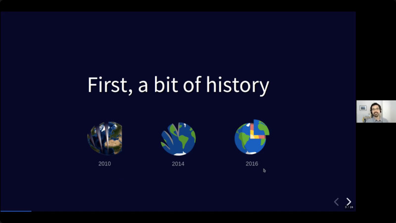

# {{ page.title }}

Fatiando a Terra is a **community-developed** collection of **open-source Python
packages** aimed primarily at Geophysics (though not exclusively).
Our tools are developed by **working geoscientists** and
**volunteers** from across the globe.

**Trivia:**
*Fatiando a Terra* is Portuguese for *Slicing the Earth*, a reference to the
project's Brazilian origins and ambitious initial goals to model the whole
planet.

## Who we are

The organization structure of Fatiando is outlined in our [Governance
document][governance]. It specifies the existing roles within our community,
what are the responsibilities assigned to each one, and how to gain
responsibilities within our organization.

Below is a list of the people currently occupying each role and the ones who
served previously.

<ul role="list" class="list-inline-center padding-vertical-l">

  <li></li>

</ul>

**Project Leaders:**
<a target="_blank" href="https://github.com/{{ id }}">{{ page.team.info[id].name }}</a>, .

**Package Maintainers:**
<a target="_blank" href="https://github.com/{{ id }}">{{ page.team.info[id].name }}</a> ({{ page.team.info[id].packages }}), .

**Package Authors:**
The [GitHub repositories][gh] for each library contain `AUTHORS.md` files which list
everyone who is considered an author of that library.
Our [Authorship Guidelines][authorship] define the rules for attributing authorship.

**Project Founders:**
<a target="_blank" href="https://github.com/{{ id }}">{{ page.team.info[id].name }}</a>, .

**Former Steering Council:**
<a target="_blank" href="https://github.com/{{ id }}">{{ page.team.info[id].name }}</a>, .

**Take part in our community:**
Open-source is more than just code, it’s about the people involved.
One of the most impactful ways in which you can help is by
[being involved](../contact) in the project!

## Funding and support

Development and maintenance of the Fatiando a Terra project is generously
supported by:

* Community and financial support from the [Software Underground][swung].
* Postdoc position salary for Santiago Soler from the [Geophysical Inversion
  Facility, University of British Columbia][gif] (from 2022).
* Salary for Leonardo Uieda from the [Universidade de São Paulo][usp] (from 2023),
  [University of Liverpool][liv] (2019-2023), and
  [Universidade do Estado do Rio de Janeiro][uerj] (2014-2017).
* A PhD scholarship for Santiago Soler from [CONICET][conicet], Argentina
  (2017-2022).
* MSc and PhD scholarships for Leonardo Uieda from [Capes][capes], Brazil
  (2010-2016).

## The geophysics Python family

Fatiando is a part of the larger family of geophysics free software in Python,
which has grown tremendously since we started development in 2010:

<ul role="list" class="list-inline-center padding-vertical-l">

  <li></li>

</ul>

We design our software to complement what is offered in other packages. Check them out as well!

## Brief history

The Fatiando a Terra project had its start around 2008 as a C++ program to
perform geophysical modeling of various data types (gravity, magnetics,
seismic, etc.).
At least that was what a
small group of Geophysics undergraduate students at the
[University of São Paulo][usp], Brazil, set out to do.
Unsurprisingly, this overly ambitious goal was never achieved.

<figure>

<figcaption>
First diagram (in Portuguese) of the planned graphical user interface (GUI) for the Fatiando C++ program. Retrieved from commit <a href="https://github.com/fatiando/fatiando/blob/10c8ff7c17df53e3e0abd83f1ce8d2a3f6bc57aa/fluxo-simples.pdf">10c8ff7</a> from 11 February 2009.
</figcaption>
</figure>

In 2010, we started developing the [`fatiando`][gh-fatiando]
Python library, which included several state-of-the-art methods for forward
modeling and inversion of gravity and magnetic data, as well as toy problems in
other fields useful for teaching.
Development of this library was discontinued in 2018 as our focus shifted to
our newer and more well-scoped libraries.
This [blog post announcing the shift][blog-fatiando-future] explains the
reasoning behind this decision.

**Legacy version:**
The last version that was released of `fatiando` is [v0.5][v0.5-doi].
The documentation for it can still be accessed at
[legacy.fatiando.org](https://legacy.fatiando.org).

We also gave a few talks that cover some of the history of the project,
many of which are recorded and up on [our YouTube channel][youtube]!

<figure>

<figcaption>
Talk <a href="https://youtu.be/z-5dvWfB_SM?si=3QrTW8tZDcPlY7W7">we gave for GFZ Helmholtz Centre Potsdam in 2021</a> about the history of Fatiando and some of the developments we had going on at the time.
</figcaption>
</figure>

[governance]: https://github.com/fatiando/community/blob/main/GOVERNANCE.md
[authorship]: https://github.com/fatiando/community/blob/main/AUTHORSHIP.md
[youtube]: https://www.youtube.com/fatiandoorg
[yt-playlist]: https://youtube.com/playlist?list=PLPA_RM8wsOqLQRajw_e9ByUe56z7TETaL
[gh]: https://github.com/fatiando
[gh-fatiando]: https://github.com/fatiando/fatiando
[usp]: https://www.iag.usp.br/
[pinga]: https://www.pinga-lab.org/
[v0.5-doi]: https://doi.org/10.5281/zenodo.157746
[blog-fatiando-future]: https://www.leouieda.com/blog/future-of-fatiando.html
[liv]: https://www.liverpool.ac.uk/earth-ocean-and-ecological-sciences/
[gif]: https://gif.eos.ubc.ca
[uerj]: https://www.uerj.br/
[conicet]: https://www.conicet.gov.ar/
[capes]: https://www.gov.br/capes
[swung]: https://softwareunderground.org
