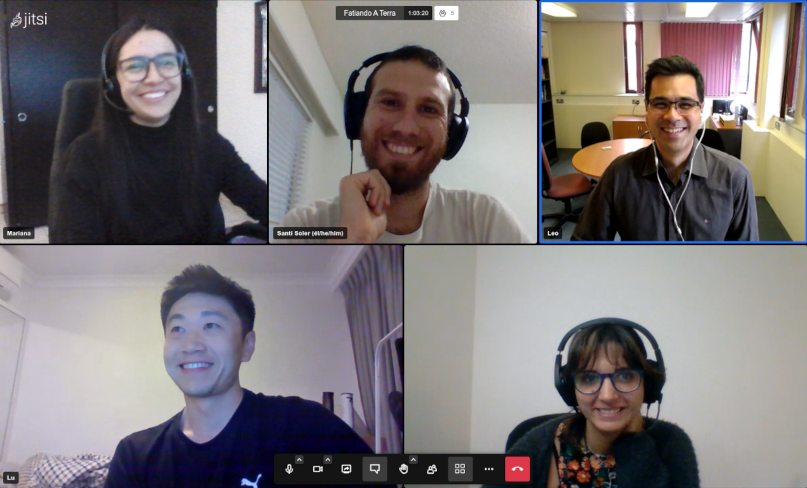

(community)=
# Community

<p class="lead">
Fatiando is a <strong>community-developed</strong> project. It's people
like you who make it useful and successful!
Our tools are developed by <strong>working geoscientists and community
volunteers</strong> from across the globe.
</p>

## <i class="fa fa-comments"></i> Participate

Open-source is more than just code, **it's about the people** involved.
The most important thing you can do for any project is **participate in the
community**: ask and answer questions, share your experience, help guide the
development, and make friends along the way.

The Fatiando community gathers in a few different places online, all of which
are **open to everyone**.
So come along and join the conversation!
See {ref}`contact` to find out where we gather.

<div class="row text-muted align-items-center fs-6">
<div class="col-md-9">

</div>
<div class="col-md-3">

Happy community members at one of our [weekly Fatiando calls](contact).

</div>
</div>

```{important}
Everyone is required to abide by our [Code of Conduct][coc] when participating
in the Fatiando community. Please review it carefully.
```

## <i class="fa fa-cog"></i> Join the development

There may be a little voice inside your head that is telling you that you're
not ready; that your skills aren't nearly good
enough to contribute.
What could you possibly offer?
We assure you that the little voice in your head is wrong.
**Being a contributor doesn't just mean writing code**.

There are many ways to contribute:

<ul class="fa-ul">
  <li><i class="fa-li fa fa-bug fa-fw"></i> Submitting bug reports and feature requests</li>
  <li><i class="fa-li fa fa-book fa-fw"></i> Writing tutorials or examples</li>
  <li><i class="fa-li fa fa-hammer fa-fw"></i> Fixing typos and improving to the documentation</li>
  <li><i class="fa-li fa fa-terminal fa-fw"></i> Writing code for everyone to use</li>
</ul>

Why participate in open-source?
There is much for you to gain from your participation:

<ul class="fa-ul">
  <li><i class="fa-li fa fa-users fa-fw"></i> Connect with a welcoming global community</li>
  <li><i class="fa-li fa fa-copy fa-fw"></i> Authorship on publications about our software</li>
  <li><i class="fa-li fa fa-graduation-cap fa-fw"></i> Learn first-hand about software engineering</li>
  <li><i class="fa-li fa fa-people-carry fa-fw"></i> Solve your own problems while benefiting the community</li>
</ul>

```{admonition} Want contribute to Fatiando?
Have a look at our [Contributing Guide][contrib] to see how you can get
involved.
This and other guides (authorship policy, project maintenance, etc.) can be
found in the [<i class="fab fa-github"></i> `fatiando/community`][community-repo]
repository.
```

## Who we are

### Authors

The [GitHub repositories][gh] for each project contain `AUTHORS.md` files which
list everyone involved.
These are the people listed in those files, in alphabetical order of last name:

<ul class="nav nav-pills mb-3" id="authors-tab" role="tablist">
  <li class="nav-item" role="presentation">
    <button
        class="nav-link active"
        id="authors-harmonica-tab"
        data-bs-toggle="pill"
        data-bs-target="#authors-harmonica"
        type="button"
        role="tab"
        aria-controls="authors-harmonica"
        aria-selected="true"
        aria-label="Harmonica"
    >
    <i class="fa fa-users"></i>
    Harmonica
    </button>
  </li>
  <li class="nav-item" role="presentation">
    <button
        class="nav-link"
        id="authors-verde-tab"
        data-bs-toggle="pill"
        data-bs-target="#authors-verde"
        type="button"
        role="tab"
        aria-controls="authors-verde"
        aria-selected="true"
        aria-label="Verde"
    >
    <i class="fa fa-users"></i>
    Verde
    </button>
  </li>
  <li class="nav-item" role="presentation">
    <button
        class="nav-link"
        id="authors-pooch-tab"
        data-bs-toggle="pill"
        data-bs-target="#authors-pooch"
        type="button"
        role="tab"
        aria-controls="authors-pooch"
        aria-selected="true"
        aria-label="Pooch"
    >
    <i class="fa fa-users"></i>
    Pooch
    </button>
  </li>
  <li class="nav-item" role="presentation">
    <button
        class="nav-link"
        id="authors-boule-tab"
        data-bs-toggle="pill"
        data-bs-target="#authors-boule"
        type="button"
        role="tab"
        aria-controls="authors-boule"
        aria-selected="true"
        aria-label="Boule"
    >
    <i class="fa fa-users"></i>
    Boule
    </button>
  </li>
  <li class="nav-item" role="presentation">
    <button
        class="nav-link"
        id="authors-ensaio-tab"
        data-bs-toggle="pill"
        data-bs-target="#authors-ensaio"
        type="button"
        role="tab"
        aria-controls="authors-ensaio"
        aria-selected="true"
        aria-label="Ensaio"
    >
    <i class="fa fa-users"></i>
    Ensaio
    </button>
  </li>
</ul>
<div class="tab-content" id="authors-tabContent">
  <div
      class="tab-pane fade show active"
      id="authors-harmonica"
      role="tabpanel"
      aria-labelledby="authors-harmonica-tab"
  >

```{fatiando-authors} harmonica
```

  </div>
  <div
      class="tab-pane fade"
      id="authors-verde"
      role="tabpanel"
      aria-labelledby="authors-verde-tab"
  >

```{fatiando-authors} verde
```

  </div>
  <div
      class="tab-pane fade"
      id="authors-pooch"
      role="tabpanel"
      aria-labelledby="authors-pooch-tab"
  >

```{fatiando-authors} pooch
```

  </div>
  <div
      class="tab-pane fade"
      id="authors-boule"
      role="tabpanel"
      aria-labelledby="authors-boule-tab"
  >

```{fatiando-authors} boule
:branch: master
```

  </div>
  <div
      class="tab-pane fade"
      id="authors-ensaio"
      role="tabpanel"
      aria-labelledby="authors-ensaio-tab"
  >

```{fatiando-authors} ensaio
```

  </div>
</div>


```{note}
Our [Authorship Guidelines][authorship] define the rules for attributing
authorship to those involved in our projects.
```

### Maintainers

The maintainers are the ones responsible for leading the projects, merging
changes, making releases, and more.

<div class="row gy-3 gx-2">
<div class="col-4 col-sm-3 col-md-2 d-flex align-items-stretch">
  <div class="card">
    
    <div class="card-body text-center">
      <p class="card-title fw-bold fs-6">
        Santiago Soler
      </p>
      <p class="card-text text-muted fs-6">
        (<a href="https://github.com/santisoler">@santisoler</a>)
      </p>
    </div>
  </div>
</div>
<div class="col-4 col-sm-3 col-md-2 gx-2 d-flex align-items-stretch">
  <div class="card">
    
    <div class="card-body text-center">
      <p class="card-title fw-bold fs-6">
        Leonardo Uieda
      </p>
      <p class="card-text text-muted fs-6">
        (<a href="https://github.com/leouieda">@leouieda</a>)
      </p>
    </div>
  </div>
</div>
</div>

[coc]: https://github.com/fatiando/community/blob/main/CODE_OF_CONDUCT.md
[contrib]: https://github.com/fatiando/community/blob/main/CONTRIBUTING.md
[community-repo]: https://github.com/fatiando/community
[gh]: https://github.com/fatiando
[notes]: https://github.com/fatiando/community
[authorship]: https://github.com/fatiando/community/blob/main/AUTHORSHIP.md
