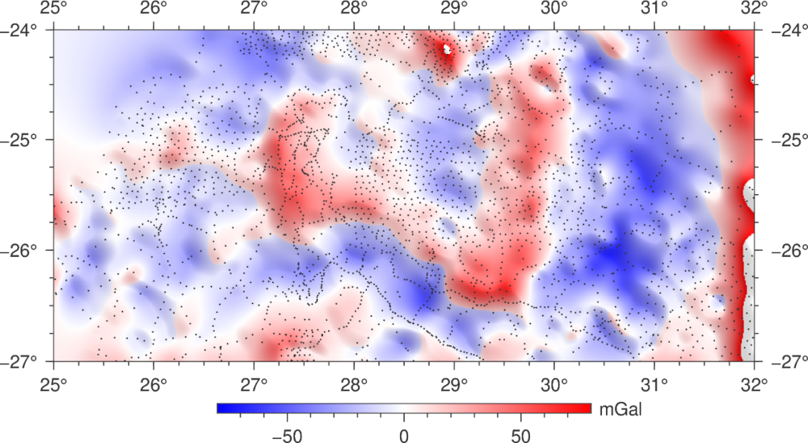
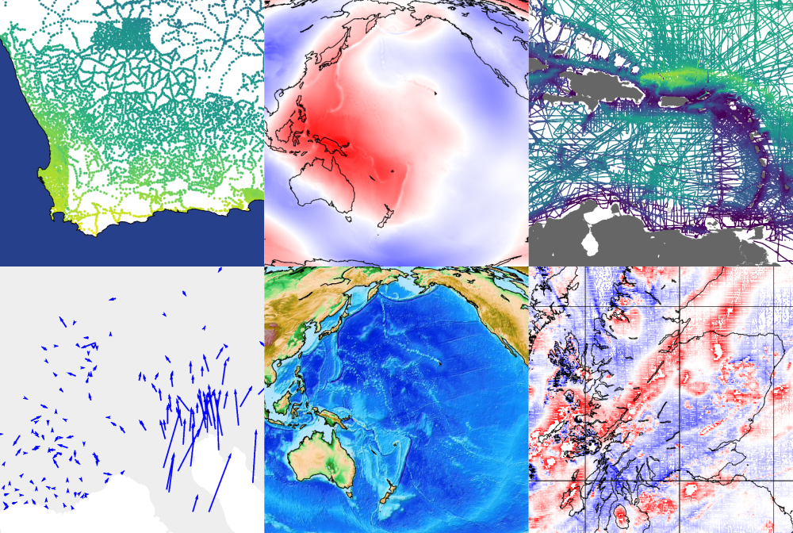
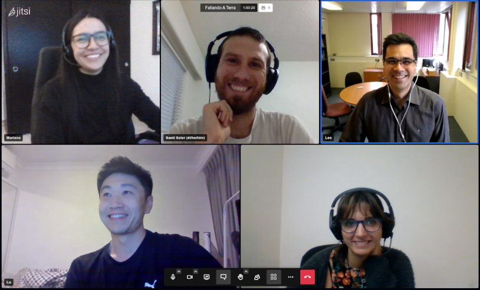

```{title} Home
```

```{toctree}
:hidden:

about/index.md
install/index.md
learn/index.md
contact/index.md
community/index.md
cite/index.md
support/index.md
```

<div class="container-fluid banner">
<div class="container">

<div class="row align-items-center gy-5">
<div class="col-md-8">

# Fatiando a Terra

<p class="banner-description">An open toolbox for the Geosciences</p>

Fatiando provides <i class="fab fa-python"></i> **Python libraries** for data
processing, modeling, and inversion across the Geosciences.

It is built by a **community** of geoscientists and software developers with
a passion for well-designed tools and helping our peers.

All of our code is **free and open-source**, distributed under the permissive
[BSD 3-clause license][bsd].

<div class="mt-5">
  <a href="#getting-started"><button type="button" class="btn btn-primary mb-3 me-3">
    <i class="fa fa-rocket"></i>
    Get started with Fatiando
  </button></a>
</div>

</div> <!-- column -->
<div class="col-md-4 order-md-first">


</div> <!-- column -->
</div> <!-- row -->

<hr class="wide-hr mt-3">

<h2 id="libraries" class="text-center">Meet our libraries</h2>

<div class="d-flex flex-wrap align-items-center justify-content-center pt-5 gap-5 fs-5">
  <a class="d-flex flex-column align-items-center text-decoration-none" href="#verde">
    
    Verde
  </a>
  <a class="d-flex flex-column align-items-center text-decoration-none" href="#pooch">
    
    Pooch
  </a>
  <a class="d-flex flex-column align-items-center text-decoration-none" href="#harmonica">
    
    Harmonica
  </a>
  <a class="d-flex flex-column align-items-center text-decoration-none" href="#boule">
    
    Boule
  </a>
  <a class="d-flex flex-column align-items-center text-decoration-none" href="#choclo">
    
    Choclo
  </a>
  <a class="d-flex flex-column align-items-center text-decoration-none" href="#ensaio">
    
    Ensaio
  </a>
</div>

<p class="text-center display-6 mt-5">
<a href="#getting-started"><i class="fas fa-chevron-circle-down text-muted"></i></a>
</p>

</div> <!-- container -->
</div> <!-- container-fluid -->

<div class="container-fluid section background-1">
<div class="container">

<div class="row align-items-center gy-5">
<div class="col-md-7">

## Getting started

<i class="fas fa-eye"></i>
**Looking for an overview?**
Watch [this recorded example][yt-demo] (~20 min) that uses our tools to
process public domain gravity data from the Bushveld Complex in South Africa.

<i class="fas fa-code"></i>
**No time for a video?**
You can also just browse [the code in the Jupyter notebook][yt-demo-nb] used in
the example.

<i class="fab fa-python"></i>
**New to Python?**
Checkout these {ref}`links to excellent free resources <learn>` for starting
your Scientific Python journey.

<i class="fas fa-flask"></i>
**Used Fatiando for research?**
Please {ref}`cite us <cite>` in your publications.

<div class="mt-5">
  <a href="install"><button type="button" class="btn btn-light mb-3 me-3">
    <i class="fab fa-linux"></i>
    <i class="fab fa-apple"></i>
    <i class="fab fa-windows me-2"></i>
    Install
  </button></a>
  <a href="learn"><button type="button" class="btn btn-primary mb-3 me-3">
    <i class="fa fa-graduation-cap"></i>
    Learn
  </button></a>
  <a href="contact"><button type="button" class="btn btn-warning mb-3 me-3">
    <i class="fa fa-hands-helping"></i>
    Need help?
  </button></a>
  <a href="support"><button type="button" class="btn btn-success mb-3">
    <i class="fas fa-people-carry me-2"></i>
    Support the project
  </button></a>
</div>

</div> <!-- column -->
<div class="col-md-5 order-md-last text-center fs-6">

<!-- Thumbnail of Youtube video -->
<div class="ratio ratio-16x9">
  <div class="yt" style='background-image: url("/_static/gfz-talk.jpg")'>
    <a
      href="https://www.youtube.com/watch?v=z-5dvWfB_SM&t=850s"
      aria-label="Watch on YouTube"
      target="_blank"
      rel="noopener noreferrer"
    >
      <div class="play-button">
        
      </div>
    </a>
    <a
      href="https://www.youtube.com/watch?v=z-5dvWfB_SM&t=850s"
      aria-label="Watch on YouTube"
      target="_blank"
      rel="noopener noreferrer"
    >
      <div class="watch-on-yt">
        <div aria-hidden="true">Watch on</div>
        <div></div>
      </div>
    </a>
  </div>
</div>

<div class="fs-6">

Recording of a talk about using Fatiando for gravimetry with a live demo of the
software.
Source code for the demonstration:
<i class="fab fa-github ms-1"></i>
[leouieda/2021-06-22-gfz](https://github.com/leouieda/2021-06-22-gfz)

</div>

</div> <!-- column -->
</div> <!-- row -->

</div> <!-- container -->
</div> <!-- container-fluid -->


<div class="container-fluid section background-3">
<div class="container">

<div class="row align-items-center gy-5">
<div class="col-md-7">

(verde)=
## **Verde:** Gridding, machine learning style

Verde offers **spatial** data processing and **interpolation** (gridding) with
a sprinkling of machine learning.

<div class="project-info">

* <i class="fa fa-check fa-fw" style="color: green" title="Project status"></i> Stable and ready for use
* <i class="fab fa-github fa-fw" title="GitHub repository"></i> Code: <a href="https://github.com/fatiando/verde">fatiando/verde</a>
* <i class="fas fa-box-open fa-fw" title="Latest version"></i> Latest version: {pypi_version}`v<verde>`
* <i class="fas fa-bookmark fa-fw" title="Publication"></i> doi: <a href="https://doi.org/10.21105/joss.00957">10.21105/joss.00957</a>

</div>

<div class="mt-4">
  <a target="_blank" href="https://www.fatiando.org/verde/">
  <button type="button" class="btn btn-secondary mb-3">
  <i class="fa fa-book"></i>
  Verde documentation
  </button>
  </a>
</div>

</div> <!-- column -->

<div class="col-md-5 order-md-last text-center fs-6">


Vertical ground velocity in California interpolated from GPS data with and
without weights based on data uncertainty.

</div> <!-- column -->
</div> <!-- row -->

</div> <!-- container -->
</div> <!-- container-fluid -->


<div class="container-fluid section background-2">
<div class="container">

<div class="row align-items-center gy-5">
<div class="col-md-7">

(pooch)=
## **Pooch:** Easily download datasets

Pooch is the easiest way to **download data files** to your computer.
It is used to manage sample data downloads not only by our own tools but also
other popular Scientific Python libraries:
[scikit-image](https://github.com/scikit-image/scikit-image),
[SciPy](https://github.com/scipy/scipy),
[MetPy](https://github.com/Unidata/MetPy),
[xarray](https://github.com/pydata/xarray),
[SHTOOLS](https://github.com/SHTOOLS/SHTOOLS),
[satpy](https://github.com/pytroll/satpy),
[icepack](https://github.com/icepack/icepack),
[histolab](https://github.com/histolab/histolab),
[yt](https://github.com/yt-project/yt),
[napari](https://github.com/napari/napari),
and [more](https://github.com/fatiando/pooch/network/dependents).

<div class="project-info">

* <i class="fa fa-check fa-fw" style="color: green" title="Project status"></i> Stable and ready for use
* <i class="fab fa-github fa-fw" title="GitHub repository"></i> Code: <a href="https://github.com/fatiando/pooch">fatiando/pooch</a>
* <i class="fas fa-box-open fa-fw" title="Latest version"></i> Latest version: {pypi_version}`v<pooch>`
* <i class="fas fa-bookmark fa-fw" title="Publication"></i> doi: <a href="https://doi.org/10.21105/joss.01943">10.21105/joss.01943</a>

</div>

<div class="mt-4">
  <a target="_blank" href="https://www.fatiando.org/pooch/">
  <button type="button" class="btn btn-secondary mb-3">
  <i class="fa fa-book"></i>
  Pooch documentation
  </button>
  </a>
</div>

</div> <!-- column -->
<div class="col-md-5 order-md-first">

```python
import pooch
import xarray as xr

# The Digital Object Identifier of the data
doi = "10.6084/m9.figshare.13643837"
# Known MD5 checksum (from figshare)
checksum = "md5:16c94a792003714efee2bdb4f3181d3a"
# Download the netCDF file and check integrity
fname = pooch.retrieve(
    url=f"doi:{doi}/australia-ground-gravity.nc",
    known_hash=checksum,
)
# fname is the path to the file
data = xr.load_dataset(fname)
```

<p class="text-center fs-6">
Running this code multiple times will only result in a single download
because the data are cached where Pooch can find it.
</p>

</div> <!-- column -->
</div> <!-- row -->

</div> <!-- container -->
</div> <!-- container-fluid -->


<div class="container-fluid section background-3">
<div class="container">

<div class="row align-items-center gy-5">
<div class="col-md-7">

(harmonica)=
## **Harmonica:** All things potential fields

Harmonica is our library for processing, forward modeling, and inversion of
**gravity and magnetic** data.
Our goal is to incentivise good practices by **carefully designing** the
software and offering **state-of-the-art methods** with efficient
implementations.

<div class="project-info">

* <i class="fa fa-sync-alt fa-fw" style="color: orange" title="Project status"></i> Functional but still evolving
* <i class="fab fa-github fa-fw" title="GitHub repository"></i> Code: <a href="https://github.com/fatiando/harmonica">fatiando/harmonica</a>
* <i class="fas fa-box-open fa-fw" title="Latest version"></i> Latest version: {pypi_version}`v<harmonica>`
* <i class="fas fa-bookmark fa-fw" title="Publication"></i> doi: <a href="https://doi.org/10.5281/zenodo.3628741">10.5281/zenodo.3628741</a>

</div>

<div class="mt-4">
  <a target="_blank" href="https://www.fatiando.org/harmonica/">
  <button type="button" class="btn btn-secondary mb-3">
  <i class="fa fa-book"></i>
  Harmonica documentation
  </button>
  </a>
</div>

</div> <!-- column -->
<div class="col-md-5 order-md-last text-center fs-6">


Residual gravity disturbances of the Bushveld Complex, South Africa,
gridded to a uniform height with equivalent sources.

</div> <!-- column -->
</div> <!-- row -->

</div> <!-- container -->
</div> <!-- container-fluid -->


<div class="container-fluid section background-2">
<div class="container">

<div class="row align-items-center gy-5">
<div class="col-md-7">

(boule)=
## **Boule:** Ellipsoids and normal gravity

Boule defines **reference ellipsoids** for calculating normal gravity of
the Earth and other planetary bodies (Moon, Mars, Venus, Mercury).

<div class="project-info">

* <i class="fa fa-sync-alt fa-fw" style="color: orange" title="Project status"></i> Functional but still evolving
* <i class="fab fa-github fa-fw" title="GitHub repository"></i> Code: <a href="https://github.com/fatiando/boule">fatiando/boule</a>
* <i class="fas fa-box-open fa-fw" title="Latest version"></i> Latest version: {pypi_version}`v<boule>`
* <i class="fas fa-bookmark fa-fw" title="Publication"></i> doi: <a href="https://doi.org/10.5281/zenodo.3530749">10.5281/zenodo.3530749</a>

</div>

<div class="mt-4">
  <a target="_blank" href="https://www.fatiando.org/boule/">
  <button type="button" class="btn btn-secondary mb-3">
  <i class="fa fa-book"></i>
  Boule documentation
  </button>
  </a>
</div>

</div> <!-- column -->
<div class="col-md-5 order-md-first text-center fs-6">


Normal gravity of the WGS84 ellipsoid calculated at the Earth's surface using
an analytical expression (no free-air correction required).

</div> <!-- column -->
</div> <!-- row -->

</div> <!-- container -->
</div> <!-- container-fluid -->

<div class="container-fluid section background-2">
<div class="container">

<div class="row align-items-center gy-5">
<div class="col-md-7">

(choclo)=
## **Choclo:** Kernel functions for your geophysical models

Optimized forward modelling functions for gravity and magnetic forward
modelling, specially tailored to be reused by other libraries, like <a
href="#harmonica">Harmonica</a>.

<div class="project-info">

* <i class="fa fa-sync-alt fa-fw" style="color: orange" title="Project status"></i> Functional but still evolving
* <i class="fab fa-github fa-fw" title="GitHub repository"></i> Code: <a href="https://github.com/fatiando/choclo">fatiando/choclo</a>
* <i class="fas fa-box-open fa-fw" title="Latest version"></i> Latest version: {pypi_version}`v<choclo>`
* <i class="fas fa-bookmark fa-fw" title="Publication"></i> doi: <a href="https://doi.org/10.5281/zenodo.7851747">10.5281/zenodo.7851747</a>

</div>

<div class="mt-4">
  <a target="_blank" href="https://www.fatiando.org/choclo/">
  <button type="button" class="btn btn-secondary mb-3">
  <i class="fa fa-book"></i>
  Choclo documentation
  </button>
  </a>
</div>

</div> <!-- column -->
<div class="col-md-5 order-md-last fs-6">

```python
import choclo

# Define observation point
easting, northing, upward = 10.4e3, -5.6e3, 110.
# Define prism boundaries and physical properties
prism = [4e3, 12e3, -10e3, -2e3, -300., 20.]
density = 2910
magnetization = [1.2, -2.3, 1.0]
# Compute gravity field of the prism
g_u = choclo.prism.gravity_u(
    easting, northing, upward, *prism, density
)
# Compute magnetic field of the prism
b_e, b_n, b_u = choclo.prism.magnetic_field(
    easting, northing, upward, *prism, *magnetization
)
```

<p class="text-center fs-6">
This code calculates the gravity acceleration and magnetic field generated by
a single prism on a single observation point.
</p>

</div> <!-- column -->
</div> <!-- row -->

</div> <!-- container -->
</div> <!-- container-fluid -->


<div class="container-fluid section background-3">
<div class="container">

<div class="row align-items-center gy-5">
<div class="col-md-7">

(ensaio)=
## **Ensaio:**  Practice datasets to probe your code

Ensaio makes it easy to download our open-access **sample datasets**. It taps
into the [Fatiando a Terra FAIR data collection](https://github.com/fatiando-data)
which is designed for use in tutorials, documentation, and teaching.

<div class="project-info">

* <i class="fa fa-sync-alt fa-fw" style="color: orange" title="Project status"></i> Functional but still evolving
* <i class="fab fa-github fa-fw" title="GitHub repository"></i> Code: <a href="https://github.com/fatiando/ensaio">fatiando/ensaio</a>
* <i class="fas fa-box-open fa-fw" title="Latest version"></i> Latest version: {pypi_version}`v<ensaio>`
* <i class="fas fa-bookmark fa-fw" title="Publication"></i> doi: <a href="https://doi.org/10.5281/zenodo.5784202">10.5281/zenodo.5784202</a>

</div>

<div class="mt-4">
  <a target="_blank" href="https://www.fatiando.org/ensaio/">
  <button type="button" class="btn btn-secondary mb-3">
  <i class="fa fa-book"></i>
  Ensaio documentation
  </button>
  </a>
</div>

</div> <!-- column -->
<div class="col-md-5 order-md-first text-center fs-6">


A sample of the datasets available in Ensaio. From the top-left: gravity, geoid
height, bathymetry, GPS velocity, global relief, and magnetic anomaly.

</div> <!-- column -->
</div> <!-- row -->

</div> <!-- container -->
</div> <!-- container-fluid -->


<div class="container-fluid section background-4">
<div class="container">

<div class="row align-items-start gy-5">
<div class="col-md-7">

# Interested?

We are always happy to **welcome anyone** who is interested in getting
involved!
Whether it be coding, teaching, designing, or just hanging out.
Getting involved in open-source can be great way to meet new people, improve
your coding skills, and **make an impact** in your field.

<div class="mt-5">
  <a href="community"><button type="button" class="btn btn-light mb-3">
    Come say "Hi!" 👋🏾
  </button></a>
</div>

</div> <!-- column -->
<div class="col-md-5 order-md-first fs-6 text-center">



Happy community members at one of our [weekly Fatiando calls](contact).

</div> <!-- column -->
</div> <!-- row -->

</div> <!-- container -->
</div> <!-- container-fluid -->


<div class="container-fluid section background-1">
<div class="container narrow">

<hr class="mb-5 wide-hr">
<div class="row align-items-start gy-5 mb-5">
<div class="col-md-6">

<h2 class="text-center fs-3">News</h2>

* 2023/05/03: Santiago gave an invited talk at
  [IGeBA](https://igeba.gl.fcen.uba.ar/) about Fatiando and open-source
  software in geosciences. The talk was in Spanish and live-streamed through
  [IGeBA's YouTube channel](https://www.youtube.com/@igeba9451) ([slides are
  available](https://www.santisoler.com/2023-fatiando-igeba)).
* 2023/03/18: Santiago gave a lightning talk at [PyCascades
  2023](https://2023.pycascades.com/) about Pooch. Watch a [recording of the
  talk](https://www.youtube.com/watch?v=KvxBc4xUMyg) ([slides are
  available](https://github.com/santisoler/2023-pycascades)).
* 2023/03/04: Santiago gave a talk to the [Canadian Exploration Geophysical
  Society (KEGS)](https://www.kegsonline.org/) about using Fatiando for
  processing and modelling gravity and magnetic fields. [Abstract and slides are
  available](https://github.com/fatiando/2023-kegs), as well as a [recording of
  the talk](https://www.youtube.com/watch?v=H0EaWOgV9xg).
* 2022/11/07: Fatiando is now on
  <i class="fab fa-mastodon" aria-hidden="true"></i>
  [Mastodon](https://fosstodon.org/@fatiando)!
* 2021/09/01: Documentation for the Python 2.7 <kbd>fatiando</kbd> package has
  been moved to [legacy.fatiando.org](https://legacy.fatiando.org).
* 2021/09/01: Fatiando is now on LinkedIn! Give
  [our page](https://www.linkedin.com/company/fatiando) a follow to keep up
  with the latest releases, events, and other news.
* 2021/05/20: Santiago, Agustina, and Leo gave a talk to the Geophysical
  Society of Houston about using Fatiando for potential field data
  ([slides are available](https://github.com/fatiando/2021-gsh)).

</div>
<div class="col-md-6">

<h2 class="text-center fs-3">Events</h2>

* **Weekly Fatiando Calls**: we discuss various aspects of the project. All are
  welcome, regardless of skill level and prior knowledge! Notes and connection
  details: [`fatiando/community`](https://github.com/fatiando/community)
* **AGU 2021**: Going to the AGU Fall Meeting? Come to our talk! Details at
  [`fatiando/agu2021`](https://github.com/fatiando/agu2021).


</div>
</div> <!-- row -->

</div> <!-- container -->
</div> <!-- container-fluid -->


[bsd]: https://opensource.org/licenses/BSD-3-Clause
[yt-demo]: https://www.youtube.com/watch?v=z-5dvWfB_SM&t=850s
[yt-demo-nb]: https://nbviewer.jupyter.org/github/leouieda/2021-06-22-gfz/blob/main/demo.ipynb
