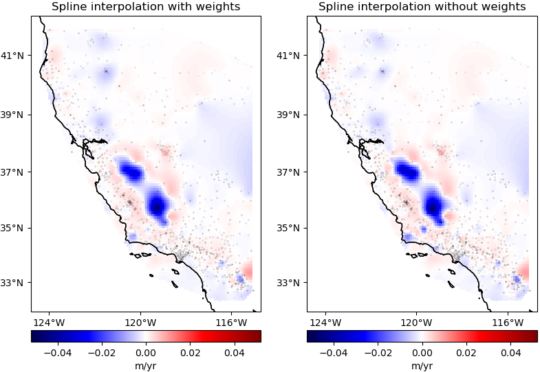
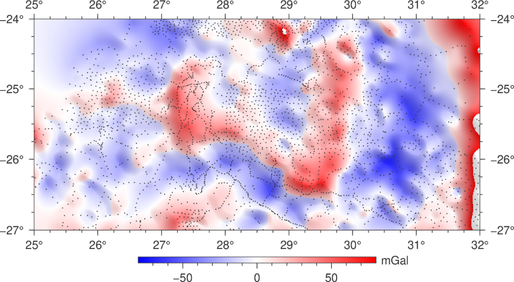
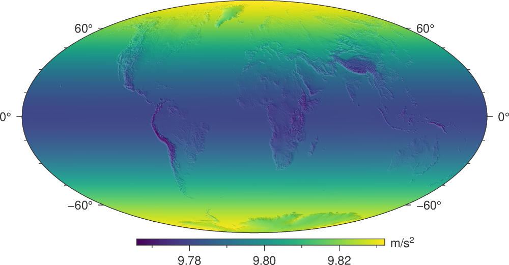
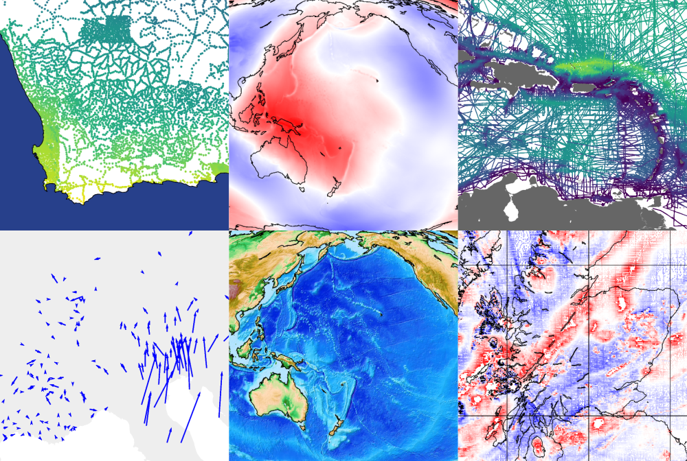

<section class="background-dark" style="background-image: url(images/background.svg); background-position: center; background-size: cover;" >
<div class="row content-wide">
<div class="col-small">
  
</div>
<div class="col-large flow">

# Fatiando a Terra

<p class="font-large font-bold">An open toolbox for the Geosciences.</p>

Fatiando provides <i class="fab fa-python"></i> **Python libraries** for data
processing, modeling, and inversion across the Geosciences.

It is built by a **community** of geoscientists and software developers with
a passion for well-designed tools and helping our peers.

All of our software is **free and open-source**.

<ul role="list" class="list-inline">
<li><a class="button-link-primary" href="install">How to install</a></li>
<li><a class="button-link-tertiary" href="support">Cite the software</a></li>
</ul>

</div>
</div>
</section>

<section class="background-primary">
<div class="row content-wide">
<div class="col-large flow">

## Getting started

**Read:**
The best place to learn more about each of our software libraries is their
**documentation pages** (AKA the *docs*). These pages contain examples,
tutorials, and technical references for all that each library does. See links to
each project below.

**Watch:**
Our [YouTube channel][youtube]
has video tutorials, demonstrations, and talks about several of the tools
that we develop.

<ul role="list" class="list-inline">
<li><a class="button-link-light" href="https://www.youtube.com/live/0bxZcCAr6bw">Harmonica tutorial</a></li>
<li><a class="button-link-light" href="https://www.youtube.com/live/-xZdNdvzm3E">Verde tutorial</a></li>
</ul>

</div>
<div class="col-small">
<figure>
  
  <figcaption>
  Screenshot from our Harmonica tutorial at Transform 2021.
  </figcaption>
</figure>
</div>
</div>
</section>

<section class="content-wide flow">

## Meet our libraries

---

<div class="row margin-top-2xl">
<div class="col-large flow">

### Verde: Gridding, machine learning style

Verde offers **spatial** data processing and **interpolation** (gridding) with
a sprinkling of machine learning.

<ul role="list">
<li><i class="fa fa-check fa-fw" style="color: green" title="Project status"></i> Stable and ready for use</li>
<li><i class="fab fa-github fa-fw" title="GitHub repository"></i> Code: <a href="https://github.com/fatiando/verde">fatiando/verde</a></li>
<li><i class="fas fa-book fa-fw" title="Documentation"></i> Documentation: <a href="https://www.fatiando.org/verde/">fatiando.org/verde</a></li>
<li><i class="fas fa-box-open fa-fw" title="Latest version"></i> Latest version: <a href="https://pypi.org/project/verde/">PyPI</a>, <a href="https://github.com/conda-forge/verde-feedstock/">conda-forge</a></li>
<li><i class="fas fa-bookmark fa-fw" title="Publication"></i> doi: <a href="https://doi.org/10.21105/joss.00957">10.21105/joss.00957</a></li>
</ul>

</div>
<div class="col-small flow">
<figure>

<figcaption>
Vertical ground velocity in California interpolated from GPS data with and
without weights based on data uncertainty.
</figcaption>
</figure>
</div>
</div>

<div class="row-reverse margin-top-2xl">
<div class="col-large flow">

### Pooch: Easily download datasets

Pooch is the easiest way to **download data files** to your computer.
It is used to manage sample data downloads not only by our own tools but also
other popular Scientific Python libraries:
[scikit-image](https://github.com/scikit-image/scikit-image),
[SciPy](https://github.com/scipy/scipy),
[MetPy](https://github.com/Unidata/MetPy),
[xarray](https://github.com/pydata/xarray),
[SHTOOLS](https://github.com/SHTOOLS/SHTOOLS),
[satpy](https://github.com/pytroll/satpy),
[icepack](https://github.com/icepack/icepack),
[histolab](https://github.com/histolab/histolab),
[yt](https://github.com/yt-project/yt),
[napari](https://github.com/napari/napari),
and [more](https://github.com/fatiando/pooch/network/dependents).

<ul role="list">
<li><i class="fa fa-check fa-fw" style="color: green" title="Project status"></i> Stable and ready for use</li>
<li><i class="fab fa-github fa-fw" title="GitHub repository"></i> Code: <a href="https://github.com/fatiando/pooch">fatiando/pooch</a></li>
<li><i class="fas fa-book fa-fw" title="Documentation"></i> Documentation: <a href="https://www.fatiando.org/pooch/">fatiando.org/pooch</a></li>
<li><i class="fas fa-box-open fa-fw" title="Latest version"></i> Latest version: <a href="https://pypi.org/project/pooch/">PyPI</a>, <a href="https://github.com/conda-forge/pooch-feedstock/">conda-forge</a></li>
<li><i class="fas fa-bookmark fa-fw" title="Publication"></i> doi: <a href="https://doi.org/10.21105/joss.01943">10.21105/joss.01943</a></li>
</ul>

</div>
<div class="col-small flow">

<figure>

```python
import pooch
import xarray as xr

# The Digital Object Identifier of the data
doi = "10.6084/m9.figshare.13643837"
# Known MD5 checksum (from figshare)
checksum = "md5:16c94a792003714efee2bdb4f3181d3a"
# Download the netCDF file and check integrity
fname = pooch.retrieve(
    url=f"doi:{doi}/australia-ground-gravity.nc",
    known_hash=checksum,
)
# fname is the path to the file
data = xr.load_dataset(fname)
```

<figcaption>
Running this code multiple times will only result in a single download
because the data are cached where Pooch can find it.
</figcaption>
</figure>

</div>
</div>


## **Harmonica:** All things potential fields

Harmonica is our library for processing, forward modeling, and inversion of
**gravity and magnetic** data.
Our goal is to incentivise good practices by **carefully designing** the
software and offering **state-of-the-art methods** with efficient
implementations.

<div class="project-info">

* <i class="fa fa-sync-alt fa-fw" style="color: orange" title="Project status"></i> Functional but still evolving
* <i class="fab fa-github fa-fw" title="GitHub repository"></i> Code: <a href="https://github.com/fatiando/harmonica">fatiando/harmonica</a>
* <i class="fas fa-box-open fa-fw" title="Latest version"></i> Latest version: {pypi_version}`v<harmonica>`
* <i class="fas fa-bookmark fa-fw" title="Publication"></i> doi: <a href="https://doi.org/10.5281/zenodo.3628741">10.5281/zenodo.3628741</a>

</div>

<div class="mt-4">
  <a target="_blank" href="https://www.fatiando.org/harmonica/">
  <button type="button" class="btn btn-secondary mb-3">
  <i class="fa fa-book"></i>
  Harmonica documentation
  </button>
  </a>
</div>


Residual gravity disturbances of the Bushveld Complex, South Africa,
gridded to a uniform height with equivalent sources.


## **Boule:** Ellipsoids and normal gravity

Boule defines **reference ellipsoids** for calculating normal gravity of
the Earth and other planetary bodies (Moon, Mars, Venus, Mercury).

<div class="project-info">

* <i class="fa fa-sync-alt fa-fw" style="color: orange" title="Project status"></i> Functional but still evolving
* <i class="fab fa-github fa-fw" title="GitHub repository"></i> Code: <a href="https://github.com/fatiando/boule">fatiando/boule</a>
* <i class="fas fa-box-open fa-fw" title="Latest version"></i> Latest version: {pypi_version}`v<boule>`
* <i class="fas fa-bookmark fa-fw" title="Publication"></i> doi: <a href="https://doi.org/10.5281/zenodo.3530749">10.5281/zenodo.3530749</a>

</div>

<div class="mt-4">
  <a target="_blank" href="https://www.fatiando.org/boule/">
  <button type="button" class="btn btn-secondary mb-3">
  <i class="fa fa-book"></i>
  Boule documentation
  </button>
  </a>
</div>



Normal gravity of the WGS84 ellipsoid calculated at the Earth's surface using
an analytical expression (no free-air correction required).


## **Choclo:** Kernel functions for your geophysical models

Optimized **forward modelling** functions for **gravity** and **magnetic**
fields, specially tailored to be reused by other libraries, like <a
href="#harmonica">Harmonica</a>.

<div class="project-info">

* <i class="fa fa-sync-alt fa-fw" style="color: orange" title="Project status"></i> Functional but still evolving
* <i class="fab fa-github fa-fw" title="GitHub repository"></i> Code: <a href="https://github.com/fatiando/choclo">fatiando/choclo</a>
* <i class="fas fa-box-open fa-fw" title="Latest version"></i> Latest version: {pypi_version}`v<choclo>`
* <i class="fas fa-bookmark fa-fw" title="Publication"></i> doi: <a href="https://doi.org/10.5281/zenodo.7851747">10.5281/zenodo.7851747</a>

</div>

<div class="mt-4">
  <a target="_blank" href="https://www.fatiando.org/choclo/">
  <button type="button" class="btn btn-secondary mb-3">
  <i class="fa fa-book"></i>
  Choclo documentation
  </button>
  </a>
</div>

</div> <!-- column -->
<div class="col-md-5 order-md-last fs-6">

```python
import choclo

# Define observation point
easting, northing, upward = 10.4e3, -5.6e3, 110.
# Define prism boundaries and physical properties
prism = [4e3, 12e3, -10e3, -2e3, -300., 20.]
density = 2910
magnetization = [1.2, -2.3, 1.0]
# Compute gravity field of the prism
g_u = choclo.prism.gravity_u(
    easting, northing, upward, *prism, density
)
# Compute magnetic field of the prism
b_e, b_n, b_u = choclo.prism.magnetic_field(
    easting, northing, upward, *prism, *magnetization
)
```

<p class="text-center fs-6">
This code calculates the gravity acceleration and magnetic field generated by
a single prism on a single observation point.
</p>


(ensaio)=
## **Ensaio:**  Practice datasets to probe your code

Ensaio makes it easy to download our open-access **sample datasets**. It taps
into the [Fatiando a Terra FAIR data collection](https://github.com/fatiando-data)
which is designed for use in tutorials, documentation, and teaching.

<div class="project-info">

* <i class="fa fa-sync-alt fa-fw" style="color: orange" title="Project status"></i> Functional but still evolving
* <i class="fab fa-github fa-fw" title="GitHub repository"></i> Code: <a href="https://github.com/fatiando/ensaio">fatiando/ensaio</a>
* <i class="fas fa-box-open fa-fw" title="Latest version"></i> Latest version: {pypi_version}`v<ensaio>`
* <i class="fas fa-bookmark fa-fw" title="Publication"></i> doi: <a href="https://doi.org/10.5281/zenodo.5784202">10.5281/zenodo.5784202</a>

</div>

<div class="mt-4">
  <a target="_blank" href="https://www.fatiando.org/ensaio/">
  <button type="button" class="btn btn-secondary mb-3">
  <i class="fa fa-book"></i>
  Ensaio documentation
  </button>
  </a>
</div>


A sample of the datasets available in Ensaio. From the top-left: gravity, geoid
height, bathymetry, GPS velocity, global relief, and magnetic anomaly.

</section>


# Interested?

We are always happy to **welcome anyone** who is interested in getting
involved!
Whether it be coding, teaching, designing, or just hanging out.
Getting involved in open-source can be great way to meet new people, improve
your coding skills, and **make an impact** in your field.

<div class="mt-5">
  <a href="community"><button type="button" class="btn btn-light mb-3">
    Come say "Hi!" 👋🏾
  </button></a>
</div>


Happy community members at one of our [weekly Fatiando calls](contact).


[youtube]: https://www.youtube.com/fatiandoorg
