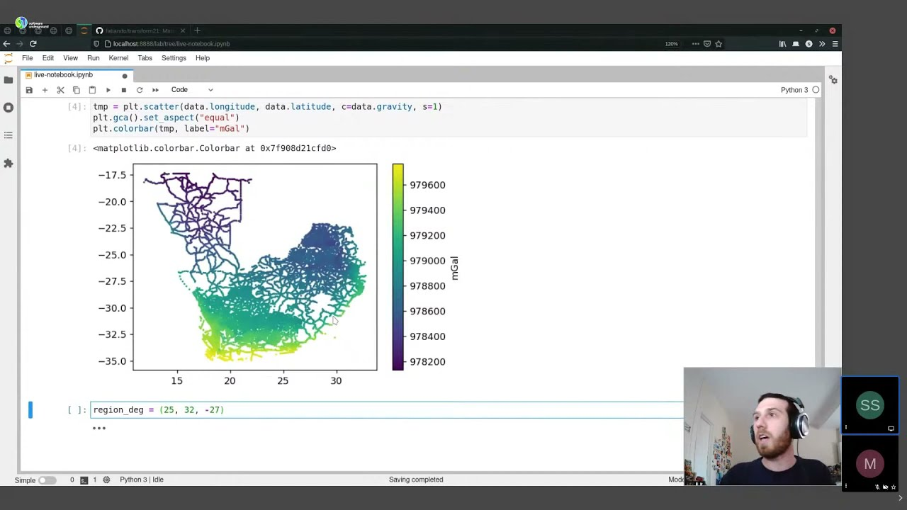
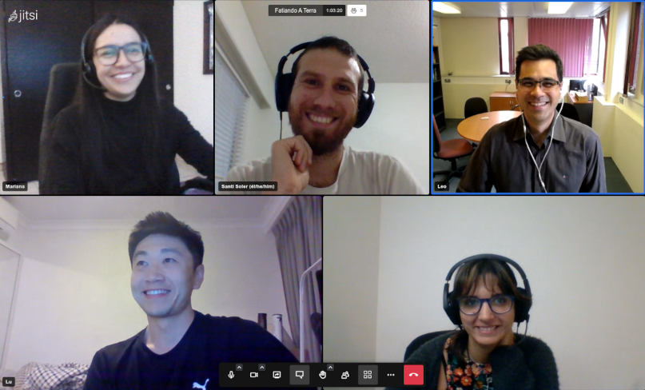

<section class="background-dark" style="background-image: url(images/background.svg); background-position: center; background-size: cover;" >
<div class="row content-wide">
<div class="col-small">
  
</div>
<div class="col-large flow">

# Fatiando a Terra

<p class="font-large font-bold">An open toolbox for the Geosciences.</p>

Fatiando provides <i class="fab fa-python"></i> **Python libraries** for data
processing, modeling, and inversion across the Geosciences.

It is built by a **community** of geoscientists and software developers with
a passion for well-designed tools and helping our peers.

All of our software is **free and open-source**.

<ul role="list" class="list-inline">
<li><a class="button-link-primary" href="install">How to install</a></li>
<li><a class="button-link-tertiary" href="support">Cite the software</a></li>
</ul>

</div>
</div>
</section>

<section class="background-primary box-shadow">
<div class="row content-wide">
<div class="col-large flow">

## Getting started

<i class="fas fa-book"></i> **Read:**
The best place to learn more about each of our software libraries is their
*documentation pages* (AKA the *docs*). These pages contain examples,
tutorials, and technical references for all that each library does. These pages always contain the **most up-to-date information**. See links to
each project below.

<i class="fab fa-python"></i> **New to Python?** Take the [Software Carpentry](https://software-carpentry.org/) lessons (online or in-person) to learn the basics. There are more lessons than just Python and everything they teach is definitely work learning!

<i class="fas fa-eye"></i> **Watch:**
Our [YouTube channel](https://www.youtube.com/fatiandoorg)
has video tutorials, demonstrations, and talks about several of the tools
that we develop. The video tutorials always have code for you to follow along (see links in the video descriptions) but they can get outdated over time.

<ul role="list" class="list-inline">
<li><a class="button-link-tertiary" href="https://www.youtube.com/fatiandoorg"><i class="fab fa-youtube"></i> YouTube channel</a></li>
<li><a class="button-link-light" href="https://www.youtube.com/live/0bxZcCAr6bw">Harmonica tutorial</a></li>
<li><a class="button-link-light" href="https://www.youtube.com/live/-xZdNdvzm3E">Verde tutorial</a></li>
</ul>

</div>
<div class="col-small">
<figure>
  
  <figcaption>
  Screenshot from our <a href="https://www.youtube.com/live/0bxZcCAr6bw">Harmonica tutorial at Transform 2021</a>.
  </figcaption>
</figure>
</div>
</div>
</section>


<div class="content-wide flow margin-top-2xl">
  <h2>Meet our libraries</h2>
  <hr>
</div>

<section class="{{ loop.cycle('', 'background-semilight box-shadow') }}">
<div class="{{ loop.cycle('row', 'row-reverse') }} content-wide">
<div class="col-large flow">
<h3 id="{{ lib. id }}">{{ lib.title }}</h3>
<p>{{ lib.description }}</p>
<ul role="list">

  <li><i class="fa fa-check fa-fw" style="color: var(--color-secondary)" title="Project status"></i> Stable and ready for use</li>

  <li><i class="fa fa-sync-alt fa-fw" style="color: var(--color-primary)" title="Project status"></i> Ready for use but still changing</li>

  <li><i class="fa fa-check fa-fw" style="color: var(--color-muted)" title="Project status"></i> Still in early development</li>

<li><i class="fab fa-github fa-fw" title="GitHub repository"></i> Code: <a href="https://github.com/fatiando/{{ lib.id }}">fatiando/{{ lib.id }}</a></li>
<li><i class="fas fa-book fa-fw" title="Documentation"></i> Documentation: <a href="https://www.fatiando.org/{{ lib.id }}/">fatiando.org/{{ lib.id }}</a></li>
<li><i class="fas fa-box-open fa-fw" title="Latest version"></i> Latest version: <a href="https://pypi.org/project/{{ lib.id }}/">PyPI</a>, <a href="https://github.com/conda-forge/{{ lib.id }}-feedstock/">conda-forge</a></li>
<li><i class="fas fa-bookmark fa-fw" title="Publication"></i> doi: <a href="https://doi.org/{{ lib.doi }}">{{ lib.doi }}</a></li>
</ul>
</div>
<div class="col-small flow">
<figure>

  


```python
{{ lib.code }}
```


<figcaption>{{ lib.caption }}</figcaption>
</figure>
</div>
</div>
</section>



<section class="background-primary box-shadow">
<div class="row content-wide">
<div class="col-large flow">

# Interested?

We are always happy to **welcome anyone** who is interested in getting
involved!
Whether it be coding, teaching, designing, or just hanging out.
Getting involved in open-source can be great way to meet new people, improve
your coding skills, and **make an impact** in your field.

<ul role="list">
<li><a class="button-link-tertiary" href="contact">Come say "Hi!" 👋🏾</a></li>
</ul>

</div>
<div class="col-small flow">

<figure>
  
  <figcaption>
  Happy community members at one of our regular <a href="contact">Fatiando open calls</a>, where we discuss the project and future plans.
  </figcaption>
</figure>

</div>
</div>
</section>
