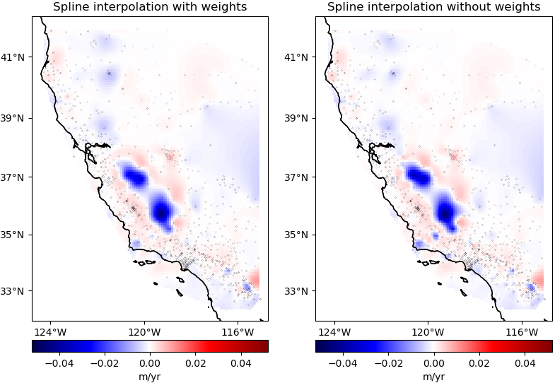

```{title} Home
```

```{toctree}
:hidden:

about/index.md
install/index.md
learn/index.md
contact/index.md
community/index.md
cite/index.md
```

<div class="container-fluid banner">
<div class="container">
<div class="row align-items-center gx-5 gy-5">
<div class="col-sm-8">

# Fatiando a Terra

<p class="banner-description">Open-source Python tools for Geophysics</p>

Fatiando provides **Python libraries** for data processing, modeling, and
inversion across the Geosciences.

It is built by a **community** of geoscientists and software developers with
a passion for well-designed tools and helping our peers.

All of our code is **free and open-source**, distributed under the permissive
[BSD 3-clause license][bsd].

<div class="mt-5">
  <a href="/about"><button type="button" class="btn btn-primary mb-3 me-3">
  More about us
  </button></a>
  <a href="/install"><button type="button" class="btn btn-light mb-3">
  Install on your computer
  <span class="bullet-separator">&bull;</span>
  <i class="fab fa-linux"></i>
  <i class="fab fa-apple"></i>
  <i class="fab fa-windows"></i>
  </button></a>
</div>

</div> <!-- column -->
<div class="col-sm-4 order-sm-first">
  
</div>
</div> <!-- row -->
</div> <!-- container -->
</div> <!-- container-fluid -->


<div class="container-fluid section background-1">
<div class="container">

<div class="row align-items-center gx-5 gy-5">
<div class="col-sm-7">

## Getting started

Placeholder placeholder placeholder placeholder placeholder placeholder
placeholder placeholder placeholder placeholder placeholder

Placeholder placeholder placeholder placeholder placeholder placeholder
placeholder placeholder placeholder placeholder placeholder

Placeholder placeholder placeholder placeholder placeholder placeholder
placeholder placeholder placeholder placeholder placeholder

<div class="mt-5">
  <a href="/learn"><button type="button" class="btn btn-light mb-3">
  <i class="fa fa-graduation-cap"></i>
  Learning resources
  </button></a>
</div>

</div> <!-- column -->
<div class="col-sm-5 order-sm-last text-center fs-6">

<div class="ratio ratio-16x9">
  <iframe src="https://www.youtube.com/embed/z-5dvWfB_SM?start=850" title="YouTube video player" frameborder="0" allowfullscreen></iframe>
</div>

<i class="fab fa-github"></i>
[leouieda/2021-06-22-gfz](https://github.com/leouieda/2021-06-22-gfz)
<span class="bullet-separator">&bull;</span>
<i class="fab fa-python"></i>
[Jupyter notebook](https://nbviewer.jupyter.org/github/leouieda/2021-06-22-gfz/blob/main/demo.ipynb)

</div> <!-- column -->
</div> <!-- row -->
</div> <!-- container -->
</div> <!-- container-fluid -->


<div class="container-fluid section background-2">
<div class="container">

<div class="row align-items-center gx-5 gy-5">
<div class="col-sm-7">

## **Verde:** Gridding, machine learning style

**Verde** offers spatial data processing and interpolation (**gridding**) with
a sprinkle of machine learning.

<a href="https://pypi.python.org/pypi/verde">

</a>

<ul class="fa-ul d-block">
<li>
  <i class="fa-li fa fa-code fa-fw" title="Latest release"></i>
  <a href="https://pypi.python.org/pypi/verde">
  
  </a>
</li>
<li>
  <i class="fa-li fab fa-github fa-fw" title="GitHub repository"></i>
  <a href="https://github.com/fatiando/verde">fatiando/verde</a>
</li>
<li>
  <i class="fa-li fas fa-bookmark fa-fw" title="Publication"></i>
   doi: <a href="https://doi.org/10.21105/joss.00957">10.21105/joss.00957</a>
</li>
<li>
  <i class="fa-li fa fa-check fa-fw" style="color: green" title="Project status"></i>
   Stable and ready for use
</li>
</ul>

<div class="mt-5">
  <a target="_blank" href="https://www.fatiando.org/verde/">
  <button type="button" class="btn btn-primary mb-3">
  <i class="fa fa-book"></i>
  Verde documentation
  </button>
  </a>
</div>

</div> <!-- column -->
<div class="col-sm-5 order-sm-first">
  
</div> <!-- column -->
</div> <!-- row -->
</div> <!-- container -->
</div> <!-- container-fluid -->


<div class="container-fluid section background-3">
<div class="container">

<div class="row align-items-center gx-5 gy-5">
<div class="col-sm-7">

## **Pooch:** Easily download datasets

**Pooch** manages the **download of data** files from a server, storing them
in a local directory, and handling updates if required. Used by our
other libraries.

<ul class="fa-ul d-block">
<li>
  <i class="fa-li fa fa-code fa-fw" title="Latest release"></i>
  <a href="https://pypi.python.org/pypi/pooch">
  
  </a>
</li>
<li>
  <i class="fa-li fab fa-github fa-fw" title="GitHub repository"></i>
  <a href="https://github.com/fatiando/pooch">fatiando/pooch</a>
</li>
<li>
  <i class="fa-li fas fa-bookmark fa-fw" title="Publication"></i>
   doi: <a href="https://doi.org/10.21105/joss.01943">10.21105/joss.01943</a>
</li>
<li>
  <i class="fa-li fa fa-check fa-fw" style="color: green" title="Project status"></i>
   Stable and ready for use
</li>
</ul>

<div class="mt-5">
  <a target="_blank" href="https://www.fatiando.org/pooch/">
  <button type="button" class="btn btn-primary mb-3">
  <i class="fa fa-book"></i>
  Pooch documentation
  </button>
  </a>
</div>

</div> <!-- column -->
<div class="col-sm-5 order-sm-last">
  
</div> <!-- column -->
</div> <!-- row -->
</div> <!-- container -->
</div> <!-- container-fluid -->


<div class="container-fluid section background-2">
<div class="container">

<div class="row align-items-center gx-5 gy-5">
<div class="col-sm-7">

## **Harmonica:**

Processing and modeling <b>gravity</b> and <b>magnetic</b> data, like terrain
correction, upward continuation, equivalent layers, 3D inversion, and more.

<ul class="fa-ul d-block">
<li>
  <i class="fa-li fa fa-code fa-fw" title="Latest release"></i>
  <a href="https://pypi.python.org/pypi/pooch">
  
  </a>
</li>
<li>
  <i class="fa-li fab fa-github fa-fw" title="GitHub repository"></i>
  <a href="https://github.com/fatiando/pooch">fatiando/pooch</a>
</li>
<li>
  <i class="fa-li fas fa-bookmark fa-fw" title="Publication"></i>
   doi: <a href="https://doi.org/10.21105/joss.01943">10.21105/joss.01943</a>
</li>
<li>
  <i class="fa-li fa fa-sync-alt fa-fw" style="color: green" title="Project status"></i>
  Ready for use but still changing
</li>
</ul>

<div class="mt-5">
  <a target="_blank" href="https://www.fatiando.org/pooch/">
  <button type="button" class="btn btn-primary mb-3">
  <i class="fa fa-book"></i>
  Pooch documentation
  </button>
  </a>
</div>

</div> <!-- column -->
<div class="col-sm-5 order-sm-first">
  
</div> <!-- column -->
</div> <!-- row -->
</div> <!-- container -->
</div> <!-- container-fluid -->


<div class="container-fluid section background-3">
<div class="container">

<div class="row align-items-center gx-5 gy-5">
<div class="col-sm-7">

## **Boule:**

Reference <b>ellipsoids</b> for geodesy and geophysics. Calculates
<b>Normal gravity</b> and coordinate conversions for the Earth and
other plantery bodies.

<ul class="fa-ul d-block">
<li>
  <i class="fa-li fa fa-code fa-fw" title="Latest release"></i>
  <a href="https://pypi.python.org/pypi/pooch">
  
  </a>
</li>
<li>
  <i class="fa-li fab fa-github fa-fw" title="GitHub repository"></i>
  <a href="https://github.com/fatiando/pooch">fatiando/pooch</a>
</li>
<li>
  <i class="fa-li fas fa-bookmark fa-fw" title="Publication"></i>
   doi: <a href="https://doi.org/10.21105/joss.01943">10.21105/joss.01943</a>
</li>
<li>
  <i class="fa-li fa fa-sync-alt fa-fw" style="color: green" title="Project status"></i>
  Ready for use but still changing
</li>
</ul>

<div class="mt-5">
  <a target="_blank" href="https://www.fatiando.org/pooch/">
  <button type="button" class="btn btn-primary mb-3">
  <i class="fa fa-book"></i>
  Pooch documentation
  </button>
  </a>
</div>

</div> <!-- column -->
<div class="col-sm-5 order-sm-last">
  
</div> <!-- column -->
</div> <!-- row -->
</div> <!-- container -->
</div> <!-- container-fluid -->


<div class="container-fluid section background-4">
<div class="container">

<div class="row align-items-center gx-5 gy-5">
<div class="col-sm-7">

# Section 4

Placeholder placeholder placeholder placeholder placeholder placeholder
placeholder placeholder placeholder placeholder placeholder

Placeholder placeholder placeholder placeholder placeholder placeholder
placeholder placeholder placeholder placeholder placeholder

Placeholder placeholder placeholder placeholder placeholder placeholder
placeholder placeholder placeholder placeholder placeholder

<div class="mt-5">
  <a href="/install"><button type="button" class="btn btn-light mb-3">
  Install on your computer
  <span class="bullet-separator">&bull;</span>
  <i class="fab fa-linux"></i>
  <i class="fab fa-apple"></i>
  <i class="fab fa-windows"></i>
  </button></a>
</div>

</div> <!-- column -->
<div class="col-sm-5 order-sm-first">
  
</div>
</div> <!-- row -->
</div> <!-- container -->
</div> <!-- container-fluid -->


[bsd]: https://opensource.org/licenses/BSD-3-Clause
