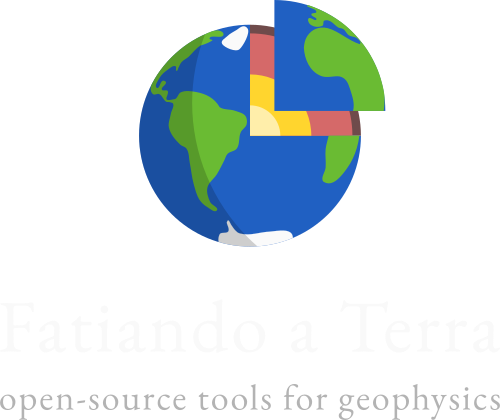

.. title:: Fatiando a Terra

.. raw:: html

   

   

   <h1>Python tools for solving geophysics problems</h1>

My main topic of research is the development of methods to solve inverse problems in
geophysics. For example, estimating density anomalies in the subsurface from measured
disturbances in gravity or the direction of magnetization of a buried structure from the
anomalies that it produces in the Earth's magnetic field. Most methods that I develop
are related to gravity and magnetics but I'm also interested in seismology and geodesy.
Central to all of my projects is the open-source software upon which I implement the new
methods.

.. raw:: html

   

   

.. raw:: html

   

   

