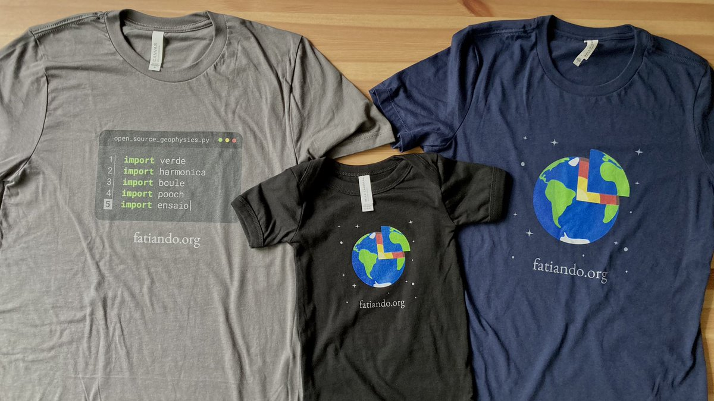
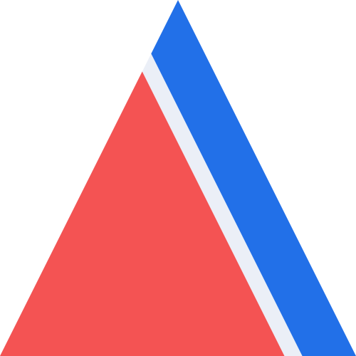

(support)=
# Support Fatiando

<p class="lead">
Here are some of the ways in which you can help support the project and give
back to the community.
</p>

## Cite our software

Citations help us justify the effort that goes into building and maintaining
this project. If you use our software, please consider
**{ref}`citing it <cite>` in your publications**.

## Get involved

Fatiando only exists because of the efforts of our **community members**, most
of which volunteer their time and energy.
One of the **most impactful ways you can help** is by
{ref}`being involved <community>`!

## Buy some merch

<i class="fa fa-tshirt fa-fw"></i>
**We have t-shirts** for sale at the [Software Underground
store][swung-shop]! Proceeds go to the Software Underground which in turn
supports our community.

<div class="row text-muted align-items-center fs-6">
<div class="col-md-9">



</div>
<div class="col-md-3">

Three types of Fatiando clothing available on the [Software Underground
store][swung-shop] (left-to-right):
one with a text editor importing [our libraries][libraries],
a baby onesie with our logo,
and a plain t-shirt with our logo.

</div>
</div>

## Spread the word

We benefit greatly from **recommendations and acknowledgements of usage** of
our software.
It helps boost morale, encourage participation, and can even help with funding
applications and job interviews for our community members.

<i class="fab fa-mastodon fa-fw"></i>
**Social media:** Share links to this website, our [GitHub][gh] repositories,
project documentation, etc.

<i class="fab fa-python fa-fw"></i>
**Publish your code:** Used our tools in your research? Why not publish your
analysis code along with the paper? {ref}`Give us a shout <contact>` and we'll
gladly share it on our social media.

<i class="fa fa-paint-brush fa-fw"></i>
**Use our logos:** Include the project logos in talks, posters, videos, and
websites about work that used our tools.

<div class="row gy-3 mt-4 align-items-center text-center">
<div class="col-4 col-sm-2">

<a target="_blank" href="../_static/fatiando-logo-background.png">

</a>

</div>
<div class="col-4 col-sm-2">

<a target="_blank" href="../_static/verde-logo.png">

</a>

</div>
<div class="col-4 col-sm-2">

<a target="_blank" href="../_static/harmonica-logo.png">

</a>

</div>
<div class="col-4 col-sm-2">

<a target="_blank" href="../_static/pooch-logo.png">

</a>

</div>
<div class="col-4 col-sm-2">

<a target="_blank" href="../_static/boule-logo.png">

</a>

</div>
<div class="col-4 col-sm-2">

<a target="_blank" href="../_static/ensaio-logo.png">

</a>

</div>
</div>

```{admonition} <i class="fas fa-download me-1"></i> Want all of them + vector graphics versions?
High quality SVG and PNG versions of the logos and other variants are all
available at <i class="fab fa-github ms-1"></i> [`fatiando/logo`][logo-repo].
```

Can't get enough? Here is a sweet **Fatiando wallpaper** in 4k resolution and
16x9 aspect ratio:

<a target="_blank" href="https://raw.githubusercontent.com/fatiando/logo/main/fatiando-wallpaper.png">

</a>

## Funding and support

Development and maintenance of the Fatiando a Terra project is generously
supported by:

* Community and financial support from the [Software Underground][swung].
* Postdoc position salary for Santiago Soler from the [Geophysical Inversion
  Facility, University of British Columbia][gif] (since 2022).
* Salary for Leonardo Uieda from the [University of Liverpool][liv]
  (from 2019) and [Universidade do Estado do Rio de Janeiro][uerj] (2014-2017).
* A PhD scholarship for Santiago Soler from [CONICET][conicet], Argentina
  (2017-2022).
* MSc and PhD scholarships for Leonardo Uieda from [Capes][capes], Brazil
  (2010-2016).

[logo-repo]: https://github.com/fatiando/logo
[gh]: https://github.com/fatiando
[liv]: https://www.liverpool.ac.uk/earth-ocean-and-ecological-sciences/
[uerj]: https://www.uerj.br/
[conicet]: https://www.conicet.gov.ar/
[gif]: https://gif.eos.ubc.ca
[capes]: https://www.gov.br/capes
[swung]: https://softwareunderground.org
[swung-shop]: https://softwareunderground.org/shop
[libraries]: ../#libraries
